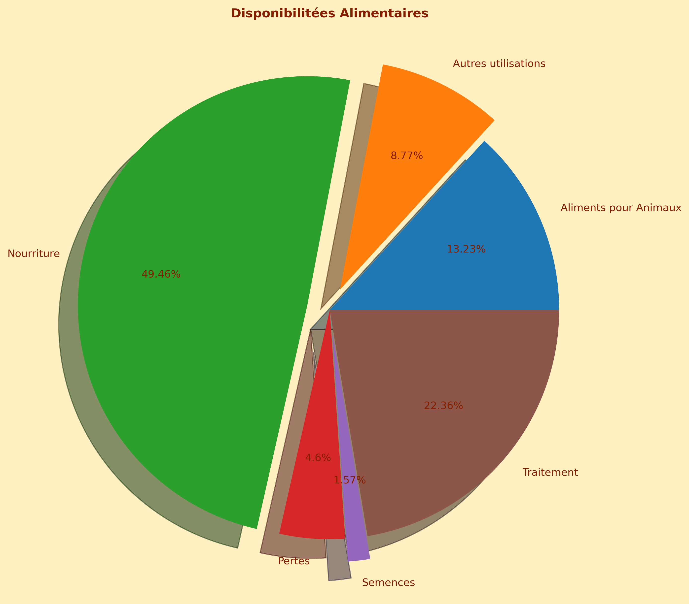

# 🌍 Étude de Santé Publique - FAO
**Projet 04 – Formation Data Analyst OpenClassrooms**

## 1. 🛠️ Technologies utilisées


---

## 2. 📌 Contexte et Objectifs

Ce projet s’inscrit dans le cadre d’une mission fictive pour la **FAO (Food and Agriculture Organization of the United Nations)**. L’objectif est d’analyser les données mondiales sur la sous-nutrition en 2017, en répondant aux demandes spécifiques de deux chercheurs :
- **Marc** : Responsable de l’équipe, souhaite un panorama global de la malnutrition.
- **Mélanie** : Chercheuse, demande une analyse par pays pour identifier ceux en difficulté alimentaire.

---

## 3. 🗂️ Structure du projet
```
04. Étude Santé Publique FAO/
├── 01. Enoncé/              # 📜 Énoncé du projet et consignes OpenClassrooms
├── 10. Données/             # 📊 Données brutes et de référence
├── 20. Notebooks/           # 📓 Notebooks Jupyter pour l'analyse
├── 30. Scripts/             # 🐍 Scripts Python utilitaires
└── 40. Resultats/           # 📈 Graphiques et résultats exportés
```

---

## 4. 🛠️ Compétences Mises en Œuvre

- **Manipulation de DataFrames** : Nettoyage, fusion et agrégation avec Pandas (gestion des valeurs manquantes, calculs de proportions). Calculs numériques avec NumPy (sommes, arrondis)
- **Visualisation** : Création de graphiques avec **Matplotlib** (camembert) et **Plotly Express** (carte choroplèthe interactive).
- **Analyse Statistique** : dentification des tendances et des pays critiques en sous-nutrition.
- **Environnement de travail** : Jupyter Notebook (Python 3) pour l'analyse et la visualisation).
- **Gestion de projet** : Organisation des données et des résultats dans une structure claire et reproductible.

---

## 5. 🔍 Méthodologie

1. **Nettoyage des données** :
   - Gestion des valeurs manquantes.
   - Conversion des unités (tonnes → kg/habitant).
2. **Analyse descriptive** :
   - Calcul des proportions de disponibilité alimentaire.
   - Identification des pays avec le plus fort ratio de sous-nutrition.
3. **Visualisation** :
   - Camembert pour les disponibilités alimentaires.
   - Carte interactive pour le ratio de sous-nutrition.

---

## 6. 📊 Résultats Clés

### 1. Disponibilités Alimentaires Mondiales (2017)
- **Nourriture** : 49,46% de la disponibilité intérieure.
- **Traitement** : 22,36% (ex. transformation industrielle).
- **Aliments pour Animaux** : 13,23%. 
- **Pertes** : 4,6%. 
- **Semences** : 1,57%. 
- **Autres utilisations** : 8,77%. 

### 2. Ratio de Sous-Nutrition par Pays (2017)
- Les pays en **rouge foncé** (ex. Afrique centrale) ont un ratio > 40%. 
- Les pays en **vert clair** (ex. Europe, Amérique du Nord) ont un ratio < 5%. 

---

## 7. 🖼️ Visualisations Clés

### Disponibilité Alimentaire (2014)

*Répartition des usages alimentaires (nourriture, pertes, semences, etc.)*

### Carte de la Sous-Nutrition dans le Monde

*Prévalence de la sous-nutrition par pays (en %)*

---

## 9. 💡 Particularités
- **Premier projet en Python** : Application concrète des bases de l’analyse de données.
- **Code pédagogique** : Commentaires détaillés pour expliquer chaque étape.
- **Visualisations simples** : Histogrammes, boxplots, et scatter plots pour explorer les données.

---

## 9.👤 Auteur
[Jérôme](https://github.com/Goumbo) — Data Analyst

## 📬 Contact
📧 [jerome.github@loriquet.fr](mailto:jerome.github@loriquet.fr)

## 🔗 Mes Dépôts GitHub
   **Dépôt**               | **Description**                            | **Lien**                                                                 |
 |-------------------------|--------------------------------------------|--------------------------------------------------------------------------|
 | 📊 **OpenClassrooms**   | Projets Data Analyst (Python, R, SQL)      | [Voir les projets](https://github.com/Goumbo/OpenClassrooms)             |
 | 📑 **Excel/VBA**        | Outils d'automatisation & tableaux de bord | [Voir les outils](https://github.com/Goumbo/Excel)                       |
