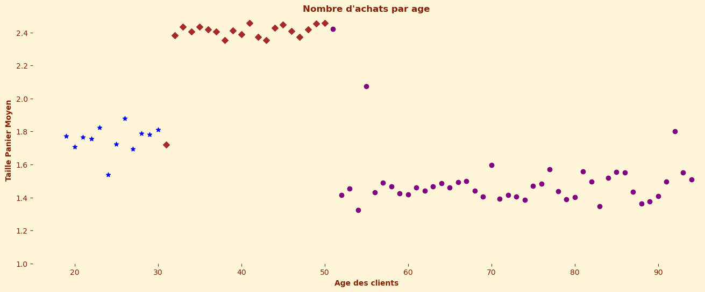
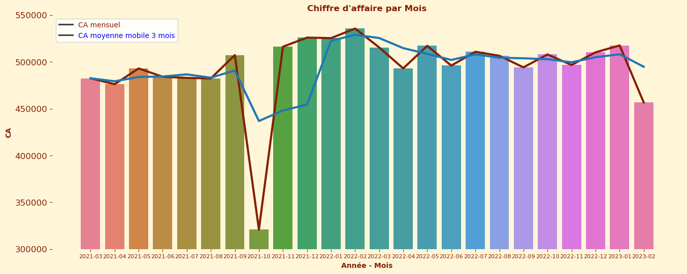
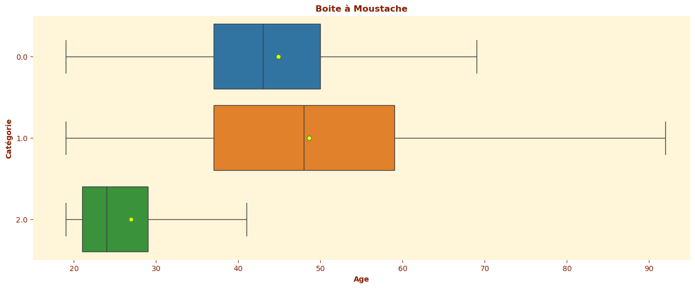
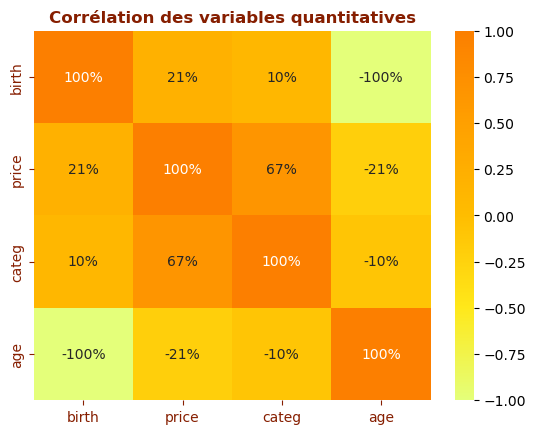

# 📚 Analyse des ventes d'une librairie en ligne
**Projet 06 – Formation Data Analyst OpenClassrooms**

---

## 1. 🛠️ Technologies utilisées


## 2. 📌 Contexte et Objectifs

Ce projet consiste à analyser les ventes en ligne de **Lapage**, une librairie généraliste, afin d'identifier les tendances, les comportements clients et les opportunités d'amélioration. Les missions principales incluent :
- **Analyse des indicateurs de vente** : Répondre aux demandes d'Antoine (chiffre d'affaires, tendances mensuelles).
- **Analyse des comportements clients** : Étudier les corrélations entre le genre/âge des clients et les catégories de livres achetés, ainsi que la fréquence d'achat et le panier moyen (demandes de Julie).

---

## 3. 🗂️ Structure du projet

06. Analyse les ventes d'une librairie/
├── 01. Enoncé/              # 📜 Énoncé du projet et consignes OpenClassrooms
├── 10. Données/             # 📊 Données brutes et de référence
├── 20. Notebooks/           # 📓 Notebooks Jupyter pour l'analyse
├── 30. Scripts/             # 🐍 Scripts Python utilitaires
└── 40. Resultats/           # 📈 Graphiques et résultats exportés
```
---

## 4. 🛠️ Compétences mises en œuvre

- **Nettoyage et préparation des données** : Gestion des valeurs manquantes, conversion des formats de dates.
- **Analyse bivariée** : Étude des corrélations entre genre/âge des clients et les catégories de livres achetés.
- **Analyse des séries temporelles** : Calcul des moyennes mobiles, identification des anomalies.
- **Visualisation** : Création de graphiques avec **Matplotlib** et **Seaborn** pour représenter les tendances et anomalies.
- **Tests statistiques** : Validation des hypothèses sur les comportements clients.

---

## 5. 🔍 Méthodologie

1. **Nettoyage des données** :
   - Correction des incohérences dans les données clients et ventes.
   - Préparation des données pour l'analyse temporelle.
2. **Analyse des ventes** :
   - Calcul du chiffre d'affaires mensuel et journalier.
   - Identification des anomalies et tendances avec des moyennes mobiles.
3. **Analyse des comportements clients** :
   - Étude des corrélations entre les caractéristiques des clients (genre, âge) et leurs achats.
   - Visualisation des résultats pour faciliter l'interprétation.

---

## 6. 📊 Résultats Clés

- **Top 3 des catégories les plus vendues** : [Ex. : Romans (35%), BD (25%), Sciences (15%)].
- **Période de pic des ventes** : [Ex. : Décembre (fêtes de fin d’année) avec +40% de CA].
- **Clients fidèles** : 20% des clients génèrent 60% du chiffre d’affaires.
- **Taux de retour** : 8% des commandes, principalement sur les livres jeunesses.
- **Recommandation** : Cibler les promotions sur les **BD et Romans** en période creuse (été).

---

## 7. 🖼️ Visualisations Clés

Voici quelques visualisations clés issues de l'analyse :

### 1. Fréquence d'achat par âge
Un scatter plot montrant la fréquence d'achat en fonction de l'âge des clients.



### 2. Montant des achats par âge
Un scatter plot montrant le montant des achats en fonction de l'âge des clients.


### 3. Nombre de ventes par mois
Un bar plot montrant le nombre de ventes par mois sur deux ans.


### 4. Chiffre d'affaires par mois
Un graphique combiné montrant le chiffre d'affaires mensuel et la moyenne mobile sur trois mois.



### 5. Boîte à moustaches des âge par catégorie
Une boîte à moustaches montrant la distribution des âges par catégorie de livres.



### 6. Matrice de corrélation des variables quantitatives
Une matrice montrant les corrélations entre l'âge, le prix, la catégorie et d'autres variables.



---

## 8. 💡 Particularités

- **21 visualisations** : Une analyse complète avec des graphiques variés pour couvrir tous les aspects des ventes et comportements clients.
- **Approche statistique** : Utilisation de tests pour valider les corrélations observées.

---

## 9.👤 Auteur
[Jérôme](https://github.com/Goumbo) — Data Analyst

## 📬 Contact
📧 [jerome.github@loriquet.fr](mailto:jerome.github@loriquet.fr)

## 🔗 Mes Dépôts GitHub
   **Dépôt**               | **Description**                            | **Lien**                                                                 |
 |-------------------------|--------------------------------------------|--------------------------------------------------------------------------|
 | 📊 **OpenClassrooms**   | Projets Data Analyst (Python, R, SQL)      | [Voir les projets](https://github.com/Goumbo/OpenClassrooms)             |
 | 📑 **Excel/VBA**        | Outils d'automatisation & tableaux de bord | [Voir les outils](https://github.com/Goumbo/Excel)                       |
